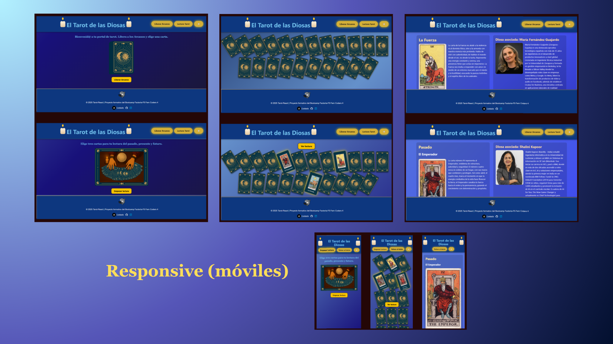
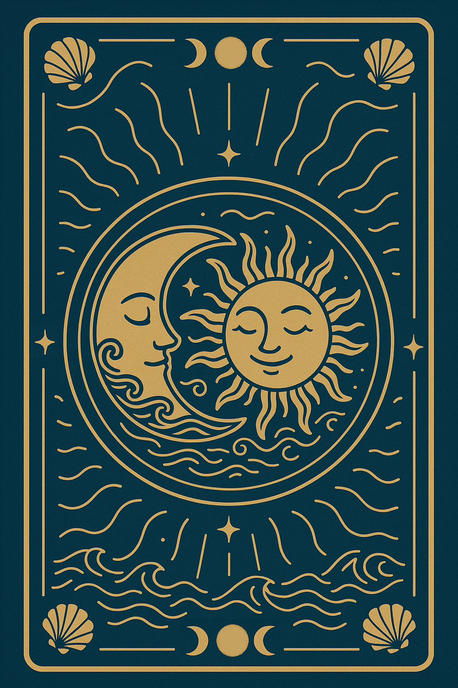

# 🌊🌞 Tarot-React 🌛🌟

## 📋 Descripción

**El tarot de las Diosas** es una aplicación web hecha en **React** que permite interactuar con un mazo de cartas de tarot y realizar lecturas personalizadas.  

Aquí se muestran las capturas de la web:
<p align="center">
  
</p>


El usuario puede:  
- Explorar todas las cartas boca abajo y elegir una para ver su significado y la diosa asociada.  
- Realizar lecturas de pasado, presente y futuro seleccionando tres cartas.  

Cada **diosa o científica histórica** asociada a las cartas aporta un valor educativo y de reconocimiento, más allá del tarot tradicional.  

---

## 💻 Tecnologías
- **React** (Hooks: `useState`, `useEffect`)  
- **JavaScript puro** para la lógica de música, scroll entre páginas y control de estado  
- **React Router** (`useNavigate`, `useParams`)  
- **CSS modular** + animaciones (fondo degradado, cartas repartidas, velas)  
- **Fetch API** para consumir la **API pública de cartas de tarot**  
  - Endpoint: `https://6872278c76a5723aacd3cbb3.mockapi.io/api/v1/tarot`  
- **Componentes reutilizables:** `AppWrapper`, `Navbar`, `Footer`, `Card`, `ScrollToTop`  

---

### 📡 Consumo de la API
La app obtiene la información de las cartas mediante la **API pública de tarot**:  
`https://6872278c76a5723aacd3cbb3.mockapi.io/api/v1/tarot`.

Se utiliza el **método GET** para:  
- **Traer todas las cartas:** devuelve un array de cartas en formato JSON.  
- **Traer una carta concreta por id:** devuelve los detalles de una carta específica, incluyendo nombre, imagen, descripción del arcano y diosa asociada.  

**Manejo básico de errores:**  
Si la respuesta de la API no es correcta (`res.ok === false`), se lanza un error para que la app pueda gestionar fallos en la carga de datos.  

Esto permite que las cartas y las imágenes se carguen **dinámicamente**, sin necesidad de almacenarlas en `assets/`, manteniendo la app ligera y actualizable fácilmente.

---

## ✅ Funcionalidades implementadas 
- Reutilización de componentes (`Navbar`, `Footer`, `Card`)  
- Animaciones de aparición de cartas (`CardsList` y `TarotReading`)  
- Selección de 3 cartas y almacenamiento en `localStorage`  
- Navegación entre páginas con React Router  
- Scroll automático al cambiar de página
- Botón de "Ver lectura" en TarotReading para responsive, que recorre la pantalla de arriba a abajo para que pueda ser activado desde cualquier parte. Al seleccionar las 3 cartas se puede clickar, antes no.
- Música de fondo continua y controlable  
- Fondo degradado animado para aportar sensación de tranquilidad  
- Trasera personalizada de cartas con mar, sol y luna  
---


## Estructura del proyecto 🗂️

```
TAROT-REACT/
│
├─ public/
│ ├─ logo.png
│ ├─ screencaps.png
│ ├─ lyrics.pdf
│ └─ whispers.mp3
│
├─ src/
│ ├─ assets/
│ ├─ components/
│ │ ├─ AppWrapper.jsx
│ │ ├─ Footer/
│ │ ├─ Navbar/
│ │ ├─ Candle.jsx
│ │ ├─ Card/
│ │ └─ ScrollToTop.jsx
│
│ ├─ pages/
│ │ ├─ CardsList.jsx
│ │ ├─ CardsDetail.jsx
│ │ ├─ TarotReading.jsx
│ │ └─ FinalReading.jsx
│
│ ├─ App.jsx
│ └─ App.css
│
└─ package.json
└─ router.jsx
```
---

## Páginas principales 🖥️
- **CardsList:** todas las cartas boca abajo con animaciones y botón para revelar arcanos.  
- **CardsDetail:** carta seleccionada + diosa asociada. Opciones de volver al inicio o empezar lectura completa.  
- **TarotReading:** selección de 3 cartas → pasado, presente, futuro. Guardado en `localStorage`.  
- **FinalReading:** muestra lectura final con interpretación y diosas asociadas.

---

- ### 💠 Cartas dinámicas
Cada carta se representa mediante el componente `Card.jsx`, que puede empezar boca abajo y voltearse al hacer click, mostrando su arcano y la diosa asociada.  
El componente usa **estado interno (`useState`)** para controlar la animación, permite **interacción por teclado** (`Enter`) y soporta **lazy loading** de imágenes para optimizar el rendimiento. Además, es **extensible** mediante `className` y `style` personalizados, adaptándose a diferentes páginas y estilos de la app.  

---

## 🖱️ Scroll entre páginas
Cada cambio de página hace scroll automáticamente hacia arriba mediante `AppWrapper`, mejorando la experiencia de navegación y evitando posiciones intermedias incómodas. 

---

## 🎨 Estilo visual

- **Fondo degradado animado:** genera un movimiento de colores oscuros y azules suaves, aportando sensación de tranquilidad nocturna.
  
- **Animación de velas en el Navbar:**  
  - La **cera** tiene un degradado suave.  
  - La **mecha** se mantiene fija.  
  - La **llama** parpadea con `@keyframes flicker`.  
  - El **humo** se eleva con `@keyframes smokeRise`.  
  - Un **resplandor (`glow`)** rodea la llama para efecto mágico.  

- **Trasera de cartas personalizada:** combina mar, sol y luna, evocando equilibrio y conexión con la naturaleza.  

<p align="center">
  
</p>  

--- 


## Música ambiental 🎶
La aplicación incluye una pista musical generada con **Suno AI**, suave y relajante, con letras que evocan el mar y la conexión con lo espiritual.   

🔹 **Implementación técnica:** asegura una experiencia inmersiva, constante y no intrusiva. 
La música se ha implementado en **JavaScript puro**, sin librerías externas.  
- El audio se crea una sola vez y se controla con un botón en el **Navbar**.  
- Se usa `localStorage` para recordar si estaba activa entre páginas.  
- Se controla la reproducción y pausa manualmente con un botón interactivo 🔊 / 🔈, garantizando que la música **siga sonando aunque el usuario navegue entre páginas**.
- Letra completa y traducción disponible en [lyrics.pdf](public/lyrics.pdf). Transmite calma y guía espiritual, como un susurro del mar y la luna. 

---

## Cómo ejecutar el proyecto ▶️
```
git clone https://github.com/Aday25/tarot-react.git
cd tarot-react
npm install
npm start

Abrir en el navegador: http://localhost:3000
```
---
<p align="center">
  <strong><em>"Las mujeres audaces, guiadas por el misterio y la ciencia, abren puertas que despiertan la luz del saber."</em></strong>
</p>

<p align="center">  </p>


> ⚠️ Nota: Este proyecto se desarrolla con fines educativos y de aprendizaje. Todo el contenido, multimedia (imágenes y música), se usa únicamente para práctica y demostración.

